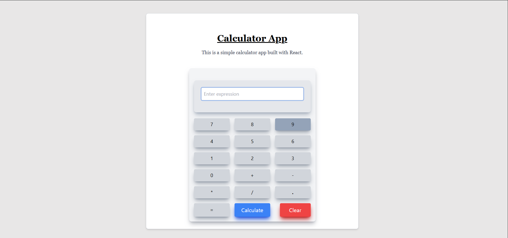

# Calculator React App

This is a simple calculator application built using **React** and **Vite**. The app allows users to perform basic arithmetic operations such as addition, subtraction, multiplication, and division. It features a clean and responsive UI.

## Preview

Here is a preview of the Calculator React App:




## Features

- Perform basic arithmetic operations (`+`, `-`, `*`, `/`).
- Responsive design for various screen sizes.
- Dynamic evaluation of mathematical expressions.
- Clear and reset functionality.
- Built with modern tools like **React** and **Vite** for fast development and performance.

## Technologies Used

- **React**: Frontend library for building user interfaces.
- **Vite**: Fast development environment for modern web applications.
- **Tailwind CSS**: Utility-first CSS framework for styling.
- **JavaScript**: Core programming language for logic implementation.

## Usage

 - Enter numbers and operators using the calculator buttons.
 - Click Calculate to evaluate the expression.
 - Click Clear to reset the input field.

## Project Structure
   calculator-react-app/
   ├── src/
   │   ├── components/
   │   │   ├── ButtonContainer.jsx
   │   │   ├── ButtonState.jsx
   │   │   ├── Display.jsx
   │   │   ├── Heading.jsx
   │   └── App.jsx
   ├── public/
   ├── package.json
   ├── README.md
   └── vite.config.js

## Installation

Follow these steps to set up the project locally:

1. Clone the repository:

   ```bash
   git clone https://github.com/your-username/calculator-react-app.git

   ```

2. Navigate to the project directory:

   ```bash
   cd calculator-react-app

   ```

3. Install dependencies:

   ```bash
   npm install

   ```

4. Start the development server:

   ```bash
   npm run dev

   ```

5. Open the app in your browser at http://localhost:5173.

## License
 - This project is licensed under the MIT License.

---

# React + Vite

This template provides a minimal setup to get React working in Vite with HMR and some ESLint rules.

Currently, two official plugins are available:

- [@vitejs/plugin-react](https://github.com/vitejs/vite-plugin-react/blob/main/packages/plugin-react) uses [Babel](https://babeljs.io/) for Fast Refresh
- [@vitejs/plugin-react-swc](https://github.com/vitejs/vite-plugin-react/blob/main/packages/plugin-react-swc) uses [SWC](https://swc.rs/) for Fast Refresh

## Expanding the ESLint configuration

If you are developing a production application, we recommend using TypeScript with type-aware lint rules enabled. Check out the [TS template](https://github.com/vitejs/vite/tree/main/packages/create-vite/template-react-ts) for information on how to integrate TypeScript and [`typescript-eslint`](https://typescript-eslint.io) in your project.
